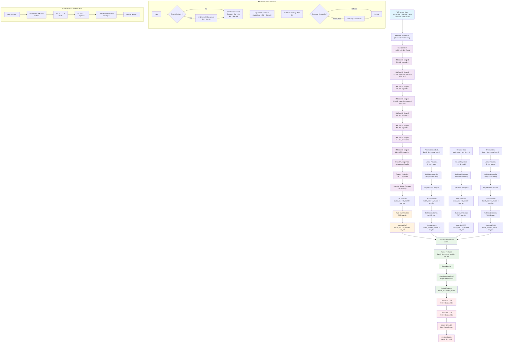

# Model Architecture Documentation

## Overview
The gesture recognition model uses a four-branch architecture that processes Time-of-Flight (ToF), accelerometer, rotation (gyroscope), and thermal sensor data separately, then fuses them for classification into 18 gesture classes.

## Architecture Diagram



## Architecture Components

### 1. TOF Branch - EfficientNet-based Spatial Processing

**Input**: `(batch_size, seq_len, 320)` - 5 sensors × 64 values each

**Key Components:**
- **Spatial Reshaping**: Each sensor's 64 values → 8×8 grid for Conv2D processing
- **EfficientNet Backbone**: MBConv2D blocks with squeeze-and-excitation
- **Feature Extraction**: Global average pooling → projection to d_model

**Architecture Details:**
```
Stem: Conv2d(1→32, 3×3) + BatchNorm2d + ReLU

MBConv2D Blocks:
- Stage 1: MBConv2D(32→16, expand_ratio=1, kernel=3×3, stride=1)
- Stage 2: MBConv2D(16→24, expand_ratio=6, kernel=3×3, stride=2) # 8×8→4×4
- Stage 2: MBConv2D(24→24, expand_ratio=6, kernel=3×3, stride=1)
- Stage 3: MBConv2D(24→40, expand_ratio=6, kernel=5×5, stride=2) # 4×4→2×2
- Stage 3: MBConv2D(40→40, expand_ratio=6, kernel=5×5, stride=1)
- Stage 4: MBConv2D(40→80, expand_ratio=6, kernel=3×3, stride=1)
- Stage 5: MBConv2D(80→112, expand_ratio=6, kernel=5×5, stride=1)
- Stage 6: MBConv2D(112→192, expand_ratio=6, kernel=5×5, stride=1)

Global Average Pooling: AdaptiveAvgPool2d(1)
Feature Projection: Linear(192 → d_model)
```

**Output**: `(batch_size, d_model, seq_len)`

### 2. Other Sensors Branches - Traditional Processing

**Accelerometer Branch:**
- **Input**: `(batch_size, seq_len, 3)` - acc_x, acc_y, acc_z
- **Components**: Linear(3 → d_model) + MultiHeadAttention + LayerNorm + Dropout
- **Output**: `(batch_size, d_model, seq_len)`

**Rotation Branch:**
- **Input**: `(batch_size, seq_len, 4)` - rot_w, rot_x, rot_y, rot_z (quaternion)
- **Components**: Linear(4 → d_model) + MultiHeadAttention + LayerNorm + Dropout
- **Output**: `(batch_size, d_model, seq_len)`

**Thermal Branch:**
- **Input**: `(batch_size, seq_len, 5)` - thm_1 through thm_5
- **Components**: Linear(5 → d_model) + MultiHeadAttention + LayerNorm + Dropout
- **Output**: `(batch_size, d_model, seq_len)`

### 3. MBConv2D Block Details

Each MBConv2D block implements the Mobile Inverted Bottleneck with:
- **Expansion Phase**: 1×1 Conv2d (if expand_ratio > 1)
- **Depthwise Convolution**: Grouped convolution for spatial processing
- **Squeeze-and-Excitation**: Channel attention mechanism
- **Point-wise Projection**: 1×1 Conv2d for dimension reduction
- **Residual Connection**: Skip connection when input/output dimensions match

### 4. MultiHead Attention Mechanism

**Per-Branch MultiHeadAttention** operates on each branch separately:
- **Purpose**: Temporal modeling and feature refinement for each sensor modality
- **Input**: `(batch_size, seq_len, d_model)` (after transpose)
- **Process**: Apply temporal attention → Transpose back
- **Output**: `(batch_size, d_model, seq_len)`

### 5. Feature Fusion & Classification

**Fusion Strategy:**
```python
# All branches output (batch_size, d_model, seq_len)
tof_features = tof_branch(tof_input)      # (batch_size, 128, seq_len)
acc_features = acc_branch(acc_input)      # (batch_size, 128, seq_len)
rot_features = rot_branch(rot_input)      # (batch_size, 128, seq_len)
thm_features = thm_branch(thm_input)      # (batch_size, 128, seq_len)

# Apply MultiHead attention to each branch
tof_features = tof_attention(tof_features)
acc_features = acc_attention(acc_features)
rot_features = rot_attention(rot_features)
thm_features = thm_attention(thm_features)

# Concatenate along feature dimension
fused = torch.cat([tof_features, acc_features, rot_features, thm_features], dim=1)  # (batch_size, 512, seq_len)
```

**Classification Head:**
```python
# Global pooling over sequence dimension
pooled = AdaptiveAvgPool1d(1)(fused).squeeze(-1)  # (batch_size, 512)

# Multi-layer classifier with dropout
classifier = Sequential(
    Linear(512 → 256) + ReLU + Dropout(0.3),
    Linear(256 → 128) + ReLU + Dropout(0.2), 
    Linear(128 → 18)  # 18 gesture classes
)
```

## Data Flow

1. **ToF Processing**: 
   - 320 features → 5×64 → 5×(8×8) grids
   - Each grid processed by EfficientNet backbone
   - Sensor features averaged per timestep
   - Output: Sequential ToF embeddings

2. **Other Sensors Processing**:
   - Accelerometer: 3 features → Linear projection → Temporal attention
   - Rotation: 4 features → Linear projection → Temporal attention  
   - Thermal: 5 features → Linear projection → Temporal attention
   - Output: Sequential sensor embeddings for each modality

3. **Feature Fusion**:
   - Concatenate ToF + ACC + ROT + THM embeddings (4 branches)
   - Apply MultiHead attention to each branch separately
   - Global temporal pooling

4. **Classification**:
   - Multi-layer MLP with dropout
   - Output: Logits for 18 gesture classes

## Model Parameters

- **d_model**: 128 (embedding dimension)
- **num_heads**: 8 (attention heads)
- **num_classes**: 18 (gesture classes)
- **seq_len**: Variable (sequence length, optional for 2D attention)

## Target Classes

**Target Behaviors (8 classes):**
- Above ear - pull hair
- Cheek - pinch skin  
- Eyebrow - pull hair
- Eyelash - pull hair
- Forehead - pull hairline
- Forehead - scratch
- Neck - pinch skin
- Neck - scratch

**Non-target Behaviors (10 classes):**
- Text on phone
- Wave hello
- Write name in air
- Pull air toward your face
- Feel around in tray and pull out an object
- Glasses on/off
- Drink from bottle/cup
- Scratch knee/leg skin
- Write name on leg
- Pinch knee/leg skin

## Usage

```python
from src.model import create_model

# Create model
model = create_model(
    num_classes=18,
    d_model=128, 
    num_heads=8,
    seq_len=100  # Optional for 2D attention
)

# Forward pass
tof_data = torch.randn(batch_size, seq_len, 320)  # ToF sensor data
acc_data = torch.randn(batch_size, seq_len, 3)    # Accelerometer data
rot_data = torch.randn(batch_size, seq_len, 4)    # Rotation/gyroscope data
thm_data = torch.randn(batch_size, seq_len, 5)    # Thermal sensor data

logits = model(tof_data, acc_data, rot_data, thm_data)  # (batch_size, 18)
```